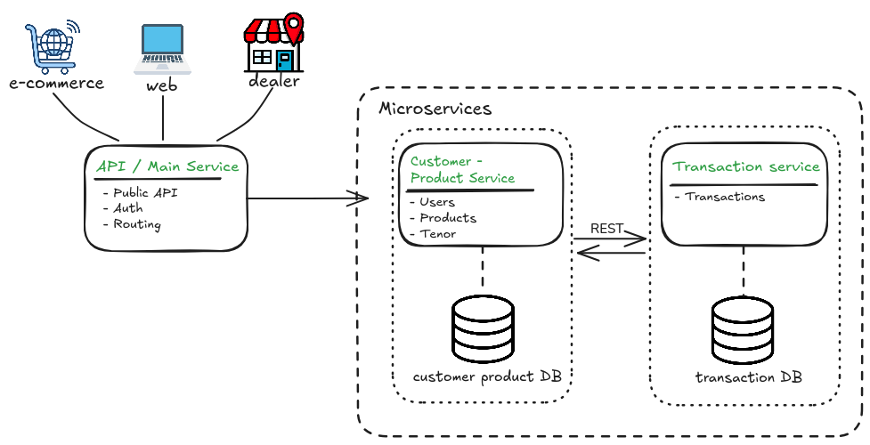
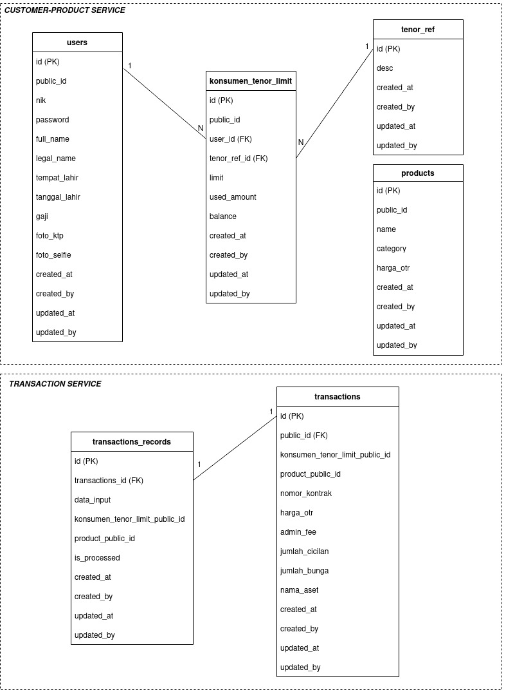

## ARSITEKTUR SISTEM

Sistem PT. XYZ terdiri dari 3 *microservices*:
1. **API / Main Service**:
bertugas untuk meng-*handle* routing, *filtering request* dan autentikasi.
2. **Customer - Product Serivce**:
bertugas untuk meng-*handle* data dan aktivitas kustomer dan produk.
3. **Transaction Service**:
bertugas untuk meng-*handle* data dan aktivitas transaksi.

Sistem PT. XYZ menggunakan JWT sebagai metode autentikasi antar *webservice*, dimana token JWT akan didapatkan setelah pengguna melakukan login. Adapun komunikasi antar webservice menggunakan REST. *Endpoints* yang tidak dicek autentikasinya adalah `/auth/login` dan `/register`.

Dengan menerapkan arsitektur *microservice* memungkinkan untuk PT XYZ melakukan *scalability* *resources* secara terpisah untuk masing-masing proses bisnis dan dalam aspek *adaptability* pengembangan dapat dilakukan dengan memisahkan *microservice* untuk proses bisnis kustomer dan produk atau dengan menambahkan sebuah *microservice* yang baru untuk proses bisnis yang baru.

Pengunaan JWT sebagai autentikasi memastikan bahwa setiap *endpoint* pada *webservice* *secure* dari akses yang tidak dinginkan, dimana pengguna harus mendapatkan token terlebih dahulu sebelum mengakses sistem (kecuali *endpoint* yang tidak diperlukan autentikasi).

Pencegahan serangan keamanan yang masuk dalam TOP 10 OWASP pada sistem PT XYZ adalah sebagai berikut:
- **AO5:2025 - *Injection***: dengan memanfaatkan GORM untuk menghindari SQL injection.
- **A07:2025 - *Authentication Failures***: dengan menggunakan JWT sebagai metode autentikasi dimana diperlukan *secret key* yang sama untuk semua *webservice*.
- **A10:2025 - *Mishandling of Exceptional Conditions***: dengan memastikan bahwa sistem yang dikembangkan melakukan *error handling* yang benar. 

## *Entity Relationship Diagram*
Sistem PT. XYZ memiliki dua database yang terdiri dari:
1. **ptxyz-customer-product**: untuk menyimpan data terkait dengan kustomer dan produk. [(download)](./ptxyz-customer-product.sql)
2. **ptxyz-transaction**: untuk menyimpan data terkait dengan transaksi. [(download)](./ptxyz-transaction.sql)

## Daftar *End Points*
Base url: http://localhost:8002/api
1. POST: /auth/login (non-JWT guraded)
2. POST: /register (non-JWT guarded)
3. POST: /transaction 
4. GET: /product/:public_id
5. GET: /konsumentenorlimit/:public_id
6. PUT: /konsumentenorlimit/updateBalance

## *Highlights Package* Yang Digunakan
* GIN: sebagai REST provider.
* GORM: untuk database.
* Viper: untuk konfigurasi.
* golang-jwt: untuk JWT.
* oklog/ulid: untuk penggunaan ULID pada kolom `public_id` di database.
